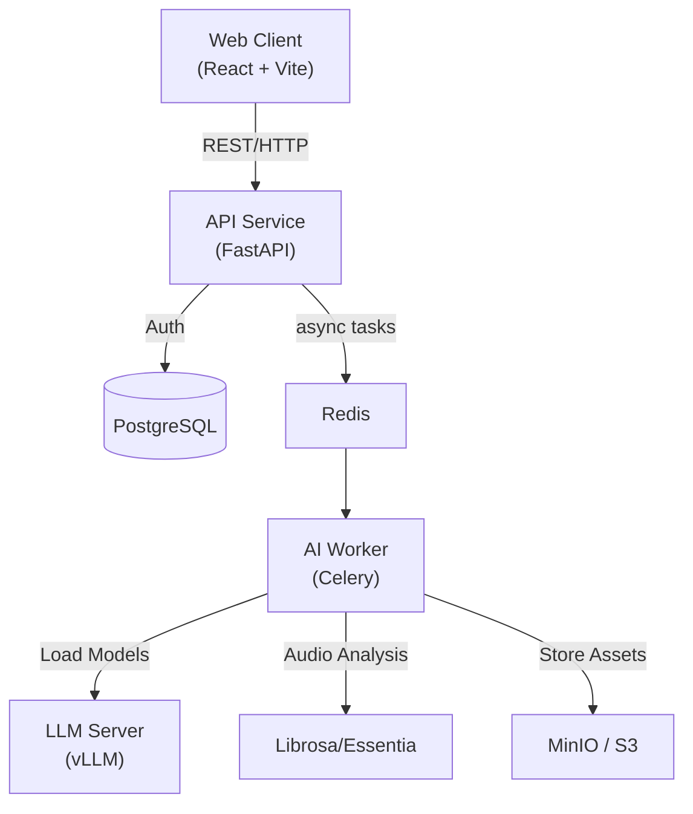

# CuePoint AI 🎛️


> **The Operating System for the Modern Music Creator.** 🚀

FROM **STUDIO** TO **STAGE**, CuePoint AI is the unified ecosystem that powers your sound.

---

## 🌟 Vision

CuePoint AI isn't just a tool; it's your co-pilot. Whether you're a bedroom producer refining your mix or a headlining DJ crafting a sunset set, our AI agents work in the background to elevate your creativity.

## ✨ Core Modules

### 🎼 Module 1: Setlist Architect
**"Perfect Flow, Every Time."**
Our AI analyzes key, BPM, and energy levels to construct harmonically coherent setlists. Describe your goal—*"90-minute high-energy techno sunset"*—and let the Architect suggest the perfect journey.

### 🩺 Module 2: Track Doctor
**"Your Personal Mixing Engineer."**
Upload your WIPs and get an instant, objective report card.
- **Mix Clarity**: 9/10
- **Low End Power**: 7/10 (Needs a boost around 50Hz!)
- **Dynamic Range**: Competitive

### 🌍 Module 3: Discovery Engine
**"Unearth the Unheard."**
A curated marketplace of high-quality, AI-vetted tracks from the underground. No more digging through crates of mediocrity. Find the gems that match *your* signature sound.

### 🤝 Module 4: Collab Hub
**"Connect. Create. Conquer."**
Find your missing vocalist, co-producer, or mastering engineer. Secure file sharing and project management built for musicians.

---

## 🏗️ Architecture

Built on a robust, cloud-native stack designed for scale.



## 🛠️ Tech Stack

- **Backend**: FastAPI ⚡, Celery 🥦, Python 🐍
- **Frontend**: React ⚛️, Tailwind CSS 🎨, Vite ⚡
- **Data & Storage**: PostgreSQL 🐘, Redis 🚀, MinIO 📦
- **Infrastructure**: Docker 🐳, Kubernetes ☸️, Terraform 🏗️

---

## ⚡ Quick Start

### Local Development (The "One-Command" Setup)

Prerequisites: `Docker` and `Docker Compose`.

1. **Clone & Enter**
   ```bash
   git clone https://github.com/GuraXLX/CUEpoint.git
   cd CUEpoint
   ```

2. **Ignition**
   ```bash
   docker-compose up --build
   ```

3. **Launch**
   - 🖥️ **Web App**: [http://localhost:5173](http://localhost:5173)
   - 🔌 **API Docs**: [http://localhost:8000/docs](http://localhost:8000/docs)
   - 🗄️ **Storage Console**: [http://localhost:9001](http://localhost:9001)

---

## ☁️ Deployment

Ready for the big leagues? CuePoint AI is "Cloud-Ready" out of the box.

- **Infrastructure as Code**: Full Terraform scripts for AWS (VPC, EKS, RDS) provided in `/terraform`.
- **Kubernetes**: Production-grade manifests in `/k8s`.

See [DEPLOYMENT.md](DEPLOYMENT.md) for the full guide.

---

## 🤝 Contributing

We welcome pull requests from code wizards and audio nerds alike. Check out [DEVELOPMENT.md](DEVELOPMENT.md) to get your dev environment spinning.

---

<p align="center">
  Made with ❤️ and 🎵 by the CuePoint AI Team
</p>
